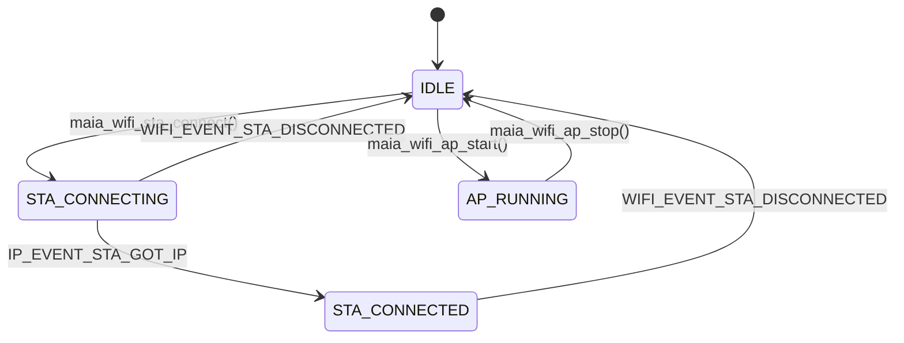
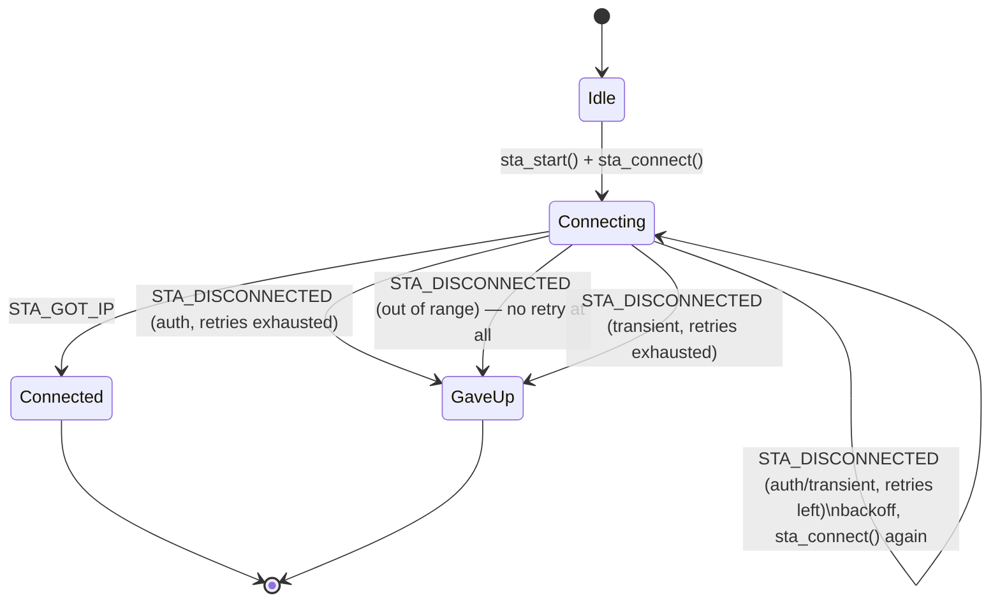

# MAIA WiFi Subsystem — Design Specification

    Version:   v2.0 (reflects implemented code)
    Date:      2026-08-02
    Author:    Vinicius May
    Target:    ESP32-S3-WROOM-1U-N16R8, ESP-IDF v6.0.0
    Branch:    feat/driver_radio_wifi
    Status:    Phases 1-4 implemented and hardware-verified. Phases 5
               (partial), 6-9 not implemented — see section 15.

    v2.0  Rewritten to describe what actually shipped, not just what was
          designed. Two structural changes from v1.2:

          1. Driver-purity correction. components/drivers/wifi/ no
             longer contains reconnect policy or boot-decision logic
             (v1.2's "RECONNECT POLICY" and MAIA_WIFI_MODE_AUTO
             sections). Both moved to main/tests/test_wifi.c, which
             plays the role of the app/service layer until one exists.
             The driver now does exactly one thing: radio mechanism,
             translated events, nothing else. See section 4.1.

          2. components/services/wifi_prov_service/ implements only
             the ESP-IDF wifi_provisioning manager path (protocomm over
             SoftAP). The custom captive portal designed in v1.1/v1.2
             section 8 (browser path, captive DNS, shared httpd) was
             NOT built — the service directory is also renamed from
             the originally planned wifi_provisioning to
             wifi_prov_service, because that name collides with
             ESP-IDF's own built-in component of the same name.

          Basic LED feedback exists (main/tests/test_wifi.c,
          led_feedback_task()), but as test-code UI glue, not a real
          board service — OLED and buttons are still untouched.

    v1.2  Captive portal designed to coexist with the manager on one
          HTTP server. (Portal never implemented — see v2.0 note.)
    v1.1  Provisioning moved to the IDF wifi_provisioning manager over
          SoftAP.
    v1.0  Initial draft: custom captive portal + WPS.

---

## 1. Purpose and Scope

MAIA needs network connectivity for one reason: **periodically syncing logged
sensor data to a server** (`MAIA_WIFI_SYNC_INTERVAL_MIN`, default 10 min). It
is not a connected product in the always-online sense — it is a
battery-powered harness on a dog that phones home when near a known network.

This document specifies what is actually built:

- the WiFi driver (`components/drivers/wifi/`) — radio mechanism only,
- the provisioning service (`components/services/wifi_prov_service/`) — gets
  the device from "no credentials" to "connected" via the ESP-IDF
  provisioning manager,
- the test harness (`main/tests/test_wifi.c`) — which currently also carries
  the reconnect policy, boot orchestration, and LED feedback that a real
  app/service layer will eventually own,
- the Kconfig surface tying it together.

**Out of scope, not yet started:** the data sync client, OTA, BLE, the
camera, the custom captive portal, OLED/button integration, WPS, MaiaProvApp's
custom endpoints. See section 15 for what each of those needs.

---

## 2. The Core Problem

MAIA must join the tutor's home WiFi. That network's SSID and password are
unknown at build time and differ per user. The device has:

- an SSD1306 128x32 OLED — 4 lines of 25 characters at 5x8 font (not wired to
  WiFi state yet — see section 12),
- one wired button (`BTN_01`, GPIO9) plus one unused (`BTN_02`, GPIO43),
- no keyboard, no touchscreen, no serial access for the end user in the field
  (serial is how *we* debug it on the bench; a tutor will never see it).

### 2.1 On-device text entry is rejected outright

A WPA2 password is up to 63 characters from a 95-character alphabet. With two
buttons the only workable scheme is "next character / confirm" — up to 95
presses per character. **This is not implemented in any form**, and is not
planned. All credential entry happens on the tutor's phone.

### 2.2 The reframing

The device does not need an input UI. **MAIA raises an Access Point, and the
tutor's phone supplies the screen and the keyboard.**

### 2.3 The fact that constrains every option

**A phone cannot read the password of the WiFi network it is currently joined
to.** Android masked `WifiConfiguration.preSharedKey` from the start and closed
the API entirely in Android 10; iOS never exposed it. Consequently **no
transport eliminates typing** — the tutor types the home WiFi password once,
on their own phone, regardless of which client app does the pairing.

### 2.4 Alternatives evaluated

| Approach | Verdict |
|---|---|
| **SoftAP + IDF `wifi_provisioning` manager** | **Implemented.** Proven protocol, crypto and PoP built in. Client today: Espressif's free "ESP SoftAP Prov" app |
| Custom captive portal (HTML + captive DNS) | **Designed (v1.1/v1.2), not implemented.** Its advantage — zero install — didn't get built this pass; the manager path covers the actual need today |
| BLE transport | Not started. One-line scheme swap in the manager config when needed; deferred until MaiaProvApp exists |
| WPS push-button (PBC) | Not started. Optional shortcut, never a dependency, when it lands |
| SmartConfig / ESP-Touch, Web Bluetooth, camera+QR, OLED QR, on-device text entry | Rejected — see v1.x history for the reasoning per option; unchanged in v2.0 |

---

## 3. Solution Overview (as built)

```
Boot (MAIA_TEST_WIFI_MODE_CONNECT, MAIA_WIFI_MODE_PROVISIONING)
 └─> wifi_prov_service_run()
      └─> maia_wifi_is_provisioned()?
           ├─ yes ─> connect directly with stored creds (bounded retry,
           │         no AP raised) — verified on hardware: WPA3-SAE home
           │         network, IP obtained in ~4s
           └─ no  ─> SoftAP "PROV_MAIA_A4F3" + wifi_provisioning manager
                      OLED/LED do not show the PoP yet — it prints to the
                      serial log only (see section 12)
```

| Client | Path | Must install | Status |
|---|---|---|---|
| ESP SoftAP Prov (Espressif) | Standard protocomm endpoints | Their free app | **Implemented, hardware-verified** |
| Phone browser | Captive portal | nothing | Designed (v1.2 §8.4), not built |
| MaiaProvApp (future) | Protocomm + custom endpoints | Our own app | Designed (§9), not built |

The three-client idea from v1.2 — one AP, one shared HTTP server — is
unaffected as a *design*; it simply hasn't been built yet, because only the
protocomm path was in scope for this pass.

---

## 4. Component Architecture

```
components/drivers/wifi/                  ← radio mechanism only
├── include/maia_wifi.h                     public API + SCOPE doc (§4.1)
├── src/maia_wifi.c                         L1 init/deinit, state, is_provisioned()
├── src/maia_wifi_sta.c                     L2 station: start/connect/stop, raw events
├── src/maia_wifi_ap.c                      L3 diagnostic AP
├── src/maia_wifi_scan.c                    L4 scan
├── src/maia_wifi_priv.h                    internal cross-file interface
├── Kconfig                                 empty — see repo convention note below
└── CMakeLists.txt                          vestigial, matches sibling drivers (§4.2)

components/services/wifi_prov_service/    ← provisioning policy
├── include/wifi_prov_service.h             single entry point: wifi_prov_service_run()
├── src/wifi_prov_service.c                 manager lifecycle, PoP, event handling
├── Kconfig                                 empty stub
└── CMakeLists.txt                          real component (§4.3)

main/tests/test_wifi.c                    ← today's stand-in for app/service policy
                                             reconnect policy, boot orchestration,
                                             LED feedback (§4.4)
```

Compared to the file list v1.2 planned (`wifi_prov_portal.c`, `wifi_prov_dns.c`,
`wifi_prov_custom_ep.c`, `wifi_prov_ui.c`, `www/portal.html`), none of those
exist. Only the manager-lifecycle file was built.

### 4.1 The driver-purity correction

Early in this branch, `components/drivers/wifi/` briefly contained a
"reconnect policy" (retry counting, exponential backoff, a give-up decision)
and a `maia_wifi_auto_start()` boot-decision function. On review, both were
recognized as **product policy wearing a driver's clothes** — a NuttX-style
driver exposes primitives and reports raw events; it does not decide how many
times to retry or what the device should do when unconfigured. Both were
removed from the driver:

- The retry/backoff/give-up state machine moved to
  `connect_with_retry_policy()` in `test_wifi.c`, built entirely on the
  driver's public API (`maia_wifi_sta_connect()`, the raw
  `MAIA_WIFI_EVENT_STA_DISCONNECTED` reason code).
- `maia_wifi_auto_start()` was deleted outright; the boot decision
  (`is_provisioned() → connect, else Kconfig seed → connect, else raise the
  diagnostic AP`) is now inlined in `test_wifi_connect()`'s
  `MAIA_WIFI_MODE_AUTO` branch.

This forced two API changes: `maia_wifi_sta_start()` now only brings the
interface up (mode, config, power-save) and no longer calls
`esp_wifi_connect()` itself; a new `maia_wifi_sta_connect()` is the separate,
repeatable primitive a retry loop calls. The state enum lost
`STA_OFFLINE`/`ERROR` (policy conclusions) and the event enum lost
`STA_AUTH_FAILED`/`NO_AP_FOUND` (policy interpretations) — `STA_DISCONNECTED`
now just carries the raw `WIFI_REASON_*` code and lets the caller decide what
it means.

**`maia_wifi_is_provisioned()` stayed in the driver.** It is a read-only query
against `esp_wifi`'s own persisted config — it doesn't decide anything, only
reports a fact — which is different in kind from the boot orchestration that
moved out.

### 4.2 Why `components/drivers/wifi/CMakeLists.txt` is unused

ESP-IDF's component discovery is non-recursive: it only looks at immediate
children of `components/`. Since `components/drivers` itself has a
`CMakeLists.txt` (the real aggregator, hand-listing every driver's sources),
IDF never looks inside `components/drivers/wifi/` for a nested component —
its `CMakeLists.txt` is display-only, matching the same (also-unused) pattern
already present in `mpu6050/`, `ssd1306/`, `lsm6dsox/`. The actual build
wiring is in `components/drivers/CMakeLists.txt`'s `DRV_SRCS` list, gated on
`CONFIG_MAIA_WIFI_ENABLE`.

### 4.3 Why `wifi_prov_service` needed a name change and `EXTRA_COMPONENT_DIRS`

Two build-system issues surfaced while wiring this component in, both fixed
and worth recording so they aren't rediscovered the hard way:

1. **Name collision.** The service was originally going to live at
   `components/services/wifi_provisioning/` — but ESP-IDF ships its own
   built-in component named exactly `wifi_provisioning`
   (`$IDF_PATH/components/wifi_provisioning`, the manager itself). Two
   same-named components in the build graph is ambiguous. Renamed the
   directory (and the header/source files) to `wifi_prov_service`.

2. **`components/services/` is one level too deep to auto-discover.** IDF's
   default component search is `components/` plus anything in
   `EXTRA_COMPONENT_DIRS`, and for each of those it only looks at *immediate*
   subdirectories. `components/services/wifi_prov_service/` is two levels
   under `components/`, so without help it is invisible — confirmed by
   checking `project_description.json`'s `all_component_info`: the five
   pre-existing `services/*` stubs (`obstacle_detection`, `haptic_feedback`,
   `power_manager`, `data_logger`, `status_monitor`) were *never* being
   discovered at all before this change, despite having real
   `idf_component_register()` calls in their `CMakeLists.txt` — dormant
   scaffolding, not dead code. Fixed by adding
   `set(EXTRA_COMPONENT_DIRS "${CMAKE_CURRENT_LIST_DIR}/components/services")`
   to the root `CMakeLists.txt`, which incidentally makes those five
   pre-existing stubs discoverable too (still not wired into `main`'s
   `REQUIRES`, so they remain inert).

3. **A `REQUIRES` gotcha, distinct from the two above.** Once discoverable,
   `wifi_prov_service` still needed to not be compiled when
   `MAIA_WIFI_ENABLE=n` (its code uses Kconfig symbols that live inside
   `depends on MAIA_WIFI_ENABLE` menus and vanish from `sdkconfig.h`
   entirely when it's off). The obvious fix —
   `if(CONFIG_MAIA_WIFI_ENABLE) list(APPEND ... wifi_prov_service) endif()`
   around the `REQUIRES` argument — **does not work**: ESP-IDF resolves each
   component's `REQUIRES`/`PRIV_REQUIRES` in an early pass, before Kconfig
   values from the actual `sdkconfig` are reliably available, so the
   conditional silently evaluates against a stale/default context rather
   than the real configuration (confirmed by hitting it directly: the
   component vanished from `main`'s resolved `reqs` even with
   `MAIA_WIFI_ENABLE=y` set on disk). `SRCS` conditionals do not have this
   problem — they're evaluated later, with the real `sdkconfig` in hand,
   which is why `test_wifi.c`'s inclusion is still safely gated that way.
   The fix: `wifi_prov_service` is `REQUIRES`'d **unconditionally**, and
   `wifi_prov_service.c`'s entire body (past the includes) is wrapped in
   `#if CONFIG_MAIA_WIFI_ENABLE ... #endif`, so the component always builds
   but compiles to an empty, harmless translation unit when WiFi is off.

### 4.4 Why policy still lives in test code

`components/app/src/app.c`'s `app_init()` is still a TODO stub — nothing in
the real application calls into WiFi at all yet. Until that changes,
`main/tests/test_wifi.c` (`MAIA_TEST_WIFI_MODE_CONNECT`) is the only caller,
so it necessarily carries what an app/service layer will eventually own:
`connect_with_retry_policy()`, the `MAIA_WIFI_MODE` boot-decision branches, and
`led_feedback_task()`. None of this is exercised by production code today —
moving it there is future work, not a rename.

---

## 5. Kconfig Design (as implemented)

Replaces the original `menu "WiFi Configuration"` in
`components/maia_board/Kconfig`. Per this repo's convention (confirmed by
inspecting every existing driver), **all Kconfig content lives in
`components/maia_board/Kconfig`** — the per-component `Kconfig` files
(`components/drivers/wifi/Kconfig`, `components/services/wifi_prov_service/Kconfig`)
are empty stubs matching the rest of the tree, not the per-component split the
v1.x drafts of this document assumed.

### 5.1 Mode selection

```kconfig
choice MAIA_WIFI_MODE
    prompt "WiFi operating mode"
    depends on MAIA_WIFI_ENABLE
    default MAIA_WIFI_MODE_AUTO
    help
        Selects what the device should do at boot. Not read by the
        driver — this is consulted by whatever code orchestrates the
        driver's primitives (currently MAIA_TEST_WIFI_MODE_CONNECT in
        test_wifi.c).

    config MAIA_WIFI_MODE_AUTO
        bool "Auto (stored credentials -> STA, else diagnostic AP)"

    config MAIA_WIFI_MODE_STA
        bool "Station only (credentials from Kconfig)"

    config MAIA_WIFI_MODE_AP
        bool "Access Point only (diagnostic)"

    config MAIA_WIFI_MODE_PROVISIONING
        bool "Interactive provisioning (SoftAP + phone app)"
        help
            If already provisioned, connect directly. Otherwise raise
            a SoftAP and run the ESP-IDF wifi_provisioning manager
            (protocomm, security 1) so a phone can supply credentials
            at runtime. Client today: "ESP SoftAP Prov" (Espressif).
endchoice
```

**Important correction from an early version of this Kconfig:** the
"Station" and "Access Point (diagnostic)" submenus originally had
`depends on !MAIA_WIFI_MODE_AP` / `!MAIA_WIFI_MODE_STA` respectively — hiding
each other's config when one mode was selected, as a menuconfig UX nicety.
**This broke the build** the moment any mode other than the "obviously
relevant" one was selected: `components/drivers/CMakeLists.txt` compiles
`maia_wifi_ap.c` and the Station code paths *unconditionally* whenever
`MAIA_WIFI_ENABLE=y` (any mode might call `maia_wifi_ap_start()` at runtime —
e.g. Auto's fallback), and `wifi_prov_service.c` unconditionally reads
`MAIA_WIFI_STA_MAX_RETRY` for its already-provisioned connect path — so
hiding those Kconfig symbols under a mode condition made them vanish from
`sdkconfig.h` while still-compiled code referenced them. Both `depends on`
clauses were changed to depend only on `MAIA_WIFI_ENABLE`.

### 5.2 Station and diagnostic AP

Unchanged in shape from v1.2's design (`MAIA_WIFI_STA_SSID/PASSWORD`,
`MAIA_WIFI_STA_MAX_RETRY`, `MAIA_WIFI_STA_RETRY_BACKOFF_MS`,
`MAIA_WIFI_STA_POWER_SAVE`, `MAIA_WIFI_SYNC_INTERVAL_MIN`;
`MAIA_WIFI_AP_SSID_PREFIX/_APPEND_MAC/_PASSWORD/_CHANNEL/_MAX_CONN`) — see
section 5.1's correction for the `depends on` fix. `MAIA_WIFI_STA_MAX_RETRY`'s
help text now documents **two** consumers instead of one:
`test_wifi.c`'s reconnect-policy demo, and `wifi_prov_service`'s
`wifi_conn_attempts` (passed straight through to the manager).

### 5.3 Interactive Provisioning (implemented; replaces v1.2's broader design)

```kconfig
menu "Interactive Provisioning"
    depends on MAIA_WIFI_ENABLE

    config MAIA_WIFI_PROV_SSID_PREFIX
        string "Provisioning AP SSID prefix"
        default "PROV_MAIA"
        help
            The stock "ESP SoftAP Prov" app filters its scan results
            by prefix, defaulting to "PROV_". Keep it while that app
            is the client.

    config MAIA_WIFI_PROV_SSID_APPEND_MAC
        bool "Append MAC suffix to the provisioning AP SSID"
        default y

    choice MAIA_WIFI_PROV_AP_SECURITY
        prompt "Provisioning AP link security"
        default MAIA_WIFI_PROV_AP_WPA2_MAC

        config MAIA_WIFI_PROV_AP_WPA2_MAC
            bool "WPA2, password derived from device MAC"
        config MAIA_WIFI_PROV_AP_WPA2_STATIC
            bool "WPA2, static password from Kconfig"
        config MAIA_WIFI_PROV_AP_OPEN
            bool "Open network (protocomm encryption only)"
    endchoice

    config MAIA_WIFI_PROV_AP_PASSWORD
        string "Static provisioning AP password (min 8 chars)"
        default "maiamute2026"
        depends on MAIA_WIFI_PROV_AP_WPA2_STATIC

    choice MAIA_WIFI_PROV_SECURITY
        prompt "Provisioning session security"
        default MAIA_WIFI_PROV_SEC1

        config MAIA_WIFI_PROV_SEC1
            bool "Security 1 (X25519 + AES-CTR, PoP)"
            select ESP_PROTOCOMM_SUPPORT_SECURITY_VERSION_1
        config MAIA_WIFI_PROV_SEC0
            bool "Security 0 (none)"
            select ESP_PROTOCOMM_SUPPORT_SECURITY_VERSION_0
    endchoice

    config MAIA_WIFI_PROV_POP_DIGITS
        int "Proof-of-possession code length (digits)"
        default 6
        range 4 8
        depends on MAIA_WIFI_PROV_SEC1

    config MAIA_WIFI_PROV_POP_STATIC
        string "Static PoP code (empty = random per session)"
        default ""
        depends on MAIA_WIFI_PROV_SEC1
        help
            Set to script provisioning with tools/esp_prov/esp_prov.py
            without reading a fresh code off the serial log every run.
            Leave empty for real use.

    config MAIA_WIFI_PROV_TIMEOUT_MIN
        int "Provisioning timeout (minutes, 0 = never)"
        default 10
        range 0 60
endmenu
```

**Differences from the v1.2 design:**

- **No `MAIA_WIFI_PROV_SECURITY_SEC2` (SRP6a).** The current `sdkconfig`
  ships with `ESP_PROTOCOMM_SUPPORT_SECURITY_VERSION_2=y` by default and
  `_0`/`_1` both disabled — meaning `WIFI_PROV_SECURITY_0`/`_1` don't even
  exist as enum values until something `select`s them in. Each of our two
  security choices does exactly that (`select
  ESP_PROTOCOMM_SUPPORT_SECURITY_VERSION_{0,1}`), so the build works
  regardless of prior `sdkconfig` state. SEC2 needs build-time salt/verifier
  generation from a username/password pair that isn't implemented — same
  reasoning v1.2 gave for deferring it, unchanged.
- **`MAIA_WIFI_PROV_POP_STATIC` is new** — not in any v1.x draft. Added for
  bench/scripting convenience (`esp_prov.py` automation without reading a
  fresh random code off the serial log every session).
- **No `MAIA_WIFI_PROV_IFACE_PROTOCOMM` / `_IFACE_PORTAL` / `_CUSTOM_EP` /
  `MAIA_WIFI_PROV_CLIENT`.** These v1.2 symbols existed to let the (never
  built) portal and the manager coexist, and to gate the (never built)
  custom endpoints for MaiaProvApp. None of that code exists, so — per this
  project's working rule of never shipping a Kconfig option with no
  implementation behind it — none of those symbols exist either. When the
  portal or the custom endpoints get built, their Kconfig lands with them.

### 5.4 Status indication

```kconfig
menu "Status indication"
    depends on MAIA_WIFI_ENABLE

    config MAIA_LED_BLINK_FREQ_AP_HZ
        int "LED blink frequency in AP mode (Hz)"
        default 5
        range 1 100

    config MAIA_LED_BLINK_FREQ_STA_HZ
        int "LED blink frequency while connecting (Hz)"
        default 1
        range 1 100
endmenu
```

These two symbols predate this branch (originally both defaulted to 10 Hz,
which conveys no information since a single indistinguishable rate can't tell
two states apart — fixed to 5/1 Hz here). They are now actually consumed, by
`test_wifi.c`'s `led_feedback_task()` (section 8.4) — previously they were
declared but nothing read them.

### 5.5 Test Kconfig

`MAIA_TEST_WIFI_MODE` has **three** options, not five:

```kconfig
choice MAIA_TEST_WIFI_MODE
    prompt "WiFi test mode"
    depends on MAIA_TEST_WIFI
    default MAIA_TEST_WIFI_MODE_SUITE

    config MAIA_TEST_WIFI_MODE_SUITE
        bool "Basic test suite"
    config MAIA_TEST_WIFI_MODE_SCAN
        bool "Network scan"
    config MAIA_TEST_WIFI_MODE_CONNECT
        bool "Exercise connectivity (per WiFi operating mode)"
        help
            Runs whatever MAIA_WIFI_MODE selects — Auto / Station / AP
            / Provisioning — entirely from code outside the driver.
endchoice

config MAIA_TEST_WIFI_LED_FEEDBACK
    bool "Blink status LED to reflect WiFi state"
    default y
    depends on MAIA_TEST_WIFI_MODE_CONNECT
    help
        Runs led_feedback_task() (section 8.5) alongside the
        connectivity test. Disable to isolate an LED-related symptom
        from the blink task itself, or if the status LED isn't wired
        the way MAIA_LED_STATUS_GPIO expects on a given board revision.
```

**`CONFIG_MAIA_TEST_WIFI` depends on `MAIA_WIFI_ENABLE`, same as every other
device test in this codebase depends on its device being enabled** (compare
`MAIA_TEST_TEMPERATURE_SENSOR` → `MAIA_DS18B20_ENABLE`, `MAIA_TEST_IMU` →
`MAIA_IMU_MPU6050`). This is not a special case introduced by this feature —
it's the established pattern. It surfaced as confusing in practice once:
with `MAIA_WIFI_ENABLE` toggled off (no comment line for it appears in
`sdkconfig` at all when off — Kconfig emits nothing, not even
`# CONFIG_MAIA_TEST_WIFI is not set`, for a symbol whose `depends on` isn't
satisfied), the entire WiFi test vanishes from `menuconfig` with no visible
trace of why. The test was never missing; the device it depends on was off.

An earlier iteration had five options (`SUITE`/`SCAN`/`STA`/`AP`/`AUTO`),
duplicating the concept `MAIA_WIFI_MODE` already existed to express.
Collapsed into `CONNECT`, whose behavior branches on the (kept, unchanged)
`MAIA_WIFI_MODE` choice — one boot-mode concept, not two.

---

## 6. State Machine (as implemented)

The driver's own state machine is now deliberately small — see section 4.1:



No "give up", "offline", or "error" state exists in the driver — a disconnect
always lands back in `IDLE` with the raw reason code handed to the caller.
Everything downstream of that (section 4.4 / 8) is the caller's problem:



This second diagram is `connect_with_retry_policy()` in `test_wifi.c` — it
does not exist as driver states, only as caller-side logic reacting to the
driver's plain events.

---

## 7. Driver API — `maia_wifi.h` (as implemented)

```c
typedef enum
{
  MAIA_WIFI_STATE_IDLE = 0,
  MAIA_WIFI_STATE_STA_CONNECTING,
  MAIA_WIFI_STATE_STA_CONNECTED,
  MAIA_WIFI_STATE_AP_RUNNING,
} maia_wifi_state_t;

typedef enum
{
  MAIA_WIFI_EVENT_STA_CONNECTED = 0,  /* L2 associated, no IP yet        */
  MAIA_WIFI_EVENT_STA_DISCONNECTED,   /* data -> stack-local uint8_t
                                       * raw WIFI_REASON_* code, valid
                                       * only for the callback's
                                       * duration                        */
  MAIA_WIFI_EVENT_STA_GOT_IP,
  MAIA_WIFI_EVENT_AP_STARTED,
  MAIA_WIFI_EVENT_AP_CLIENT_JOINED,
  MAIA_WIFI_EVENT_AP_CLIENT_LEFT,
  MAIA_WIFI_EVENT_SCAN_DONE,
} maia_wifi_event_t;

/* L1 - Core */
esp_err_t          maia_wifi_init(maia_wifi_callback_t cb);
esp_err_t          maia_wifi_deinit(void);
maia_wifi_state_t  maia_wifi_get_state(void);
esp_err_t          maia_wifi_get_mac_suffix(char *out, size_t len);
bool               maia_wifi_is_provisioned(void);

/* L2 - Station (bring-up and association are separate primitives —
 *      this is what makes a caller-side retry loop possible without
 *      redoing setup each attempt) */
esp_err_t maia_wifi_sta_start(const maia_wifi_creds_t *creds);  /* NULL = stored */
esp_err_t maia_wifi_sta_connect(void);
esp_err_t maia_wifi_sta_stop(void);
esp_err_t maia_wifi_sta_get_ip(esp_netif_ip_info_t *ip);
esp_err_t maia_wifi_sta_get_rssi(int8_t *rssi);

/* L3 - Access Point (diagnostic only) */
esp_err_t maia_wifi_ap_start(void);
esp_err_t maia_wifi_ap_stop(void);

/* L4 - Scan */
esp_err_t maia_wifi_scan(maia_wifi_ap_info_t *results, size_t max,
                         size_t *found);
```

Removed relative to earlier drafts: `maia_wifi_auto_start()` (section 4.1),
`MAIA_WIFI_STATE_STA_OFFLINE`/`_ERROR`, `MAIA_WIFI_EVENT_STA_AUTH_FAILED`/
`_NO_AP_FOUND`. No WPS (L5) — not started.

---

## 8. Provisioning Service — `wifi_prov_service` (as implemented)

### 8.1 Entry point

```c
esp_err_t wifi_prov_service_run(void);   /* blocking */
```

That is the entire public API. It:

1. Calls `maia_wifi_init(NULL)` — idempotent (no-ops if the caller already
   initialized the driver, e.g. `test_wifi_run()` does, with its own
   callback; `wifi_prov_service_run()` doesn't need a driver-level callback
   of its own since it polls state / uses the manager's dedicated callback
   instead — see 8.3).
2. Branches on `maia_wifi_is_provisioned()`:
   - **true** → `connect_stored_credentials()`: `maia_wifi_sta_start(NULL)`,
     then up to `MAIA_WIFI_STA_MAX_RETRY` rounds of `maia_wifi_sta_connect()`
     with a bounded per-attempt timeout, polling `maia_wifi_get_state()`.
     Deliberately simpler than `test_wifi.c`'s reconnect-policy demo (no
     reason-code classification, no exponential backoff) — this is the
     service's own, plainer "just try N times" policy for the boring case
     where credentials already work.
   - **false** → `run_interactive_provisioning()` (8.2).

### 8.2 Interactive provisioning

```c
wifi_prov_mgr_config_t cfg = {
    .scheme               = wifi_prov_scheme_softap,
    .scheme_event_handler = WIFI_PROV_EVENT_HANDLER_NONE,
    .app_event_handler    = { .event_cb = prov_event_cb, .user_data = &ctx },
    .wifi_prov_conn_cfg   = { .wifi_conn_attempts = CONFIG_MAIA_WIFI_STA_MAX_RETRY },
};
wifi_prov_mgr_init(cfg);
/* build_service_name() -> "PROV_MAIA_A4F3" (prefix + MAC suffix, reusing
 * maia_wifi_get_mac_suffix()) */
/* build_ap_password() -> MAC-derived / static / NULL (open), per Kconfig */
/* build_pop() -> MAIA_WIFI_PROV_POP_STATIC if set, else N random digits
 * from esp_random() */
wifi_prov_mgr_start_provisioning(WIFI_PROV_SECURITY_1, pop, ssid, service_key);
/* block on an EventGroup for CRED_SUCCESS or CRED_FAIL, with a timeout
 * derived from MAIA_WIFI_PROV_TIMEOUT_MIN (or portMAX_DELAY if 0) */
```

`prov_event_cb()` (the manager's `app_event_handler`, not a
`maia_wifi_callback_t` — a separate, dedicated callback slot with no
interaction with the driver's own callback) maps
`WIFI_PROV_START/CRED_RECV/CRED_FAIL/CRED_SUCCESS/END` to log lines and
`EventGroup` bits. **It logs the received SSID, never the password** —
confirmed by direct code review when the question came up during testing.
On `CRED_SUCCESS` the manager auto-stops itself (emits `WIFI_PROV_END` on its
own); on `CRED_FAIL` or timeout, `wifi_prov_mgr_stop_provisioning()` is called
explicitly. Either way, `wifi_prov_mgr_deinit()` follows once `WIFI_PROV_END`
is observed (or a bounded wait for it elapses).

On success, **the station is already connected** — the manager did the
`esp_wifi_connect()` internally as part of verifying the submitted
credentials. The caller does not need to call `maia_wifi_sta_start()`/
`_connect()` afterward; `maia_wifi_get_state()` already reflects
`STA_CONNECTED` because the driver's event handlers observe `WIFI_EVENT`/
`IP_EVENT` unconditionally, regardless of who initiated the connection
attempt (see the "no conflict" note in `wifi_prov_service.h`).

### 8.3 No conflict with the driver, verified

This was a design requirement, not just a hope, and it held up under actual
hardware testing:

- The driver's own STA/AP event handlers keep running the entire time the
  manager is active — they only translate events into driver state, never
  call `esp_wifi_connect()`/`disconnect()`/`set_mode()` themselves (only
  `maia_wifi_sta_start()`/`_connect()`/`_stop()` and `maia_wifi_ap_start()`/
  `_stop()` do that), and this service never calls those while the manager
  owns the radio.
- `maia_wifi_init()`'s `g_initialized` guard makes the service's own call to
  it a safe no-op when the caller (`test_wifi_run()`) already initialized the
  driver with its own callback.
- Hardware confirmation: a real device, already provisioned onto a WPA3-SAE
  home network, connected cleanly through `connect_stored_credentials()` —
  associated, negotiated WPA3-SAE, got an IP, all while the driver's ordinary
  event handlers ran throughout with no interference.

### 8.4 What is not implemented

- **Custom captive portal** (v1.2 §8.1/8.4/8.6: shared `httpd`, browser
  handlers, captive DNS, `portal.html`). Zero of that code exists. The
  `wifi_prov_scheme_softap_set_httpd_handle()` mechanism v1.2 designed around
  is unused because there is no second httpd to share it with.
- **OLED/LED/button UI** for provisioning (v1.2 §12). The PoP code, AP name,
  and password print to the **serial log only** — there is no on-device
  display of any of it. This matters operationally: a tutor in the field has
  no way to read the PoP code today. Basic LED *is* implemented, but as
  generic WiFi-state feedback in test code (section 8.5 below), not
  provisioning-specific UI.
- **Custom protocomm endpoints** for MaiaProvApp (section 9). Reserved in
  design, no code.
- **WPS.** Not started.

### 8.5 LED feedback (new in this pass, lives in test code)

`main/tests/test_wifi.c`'s `led_feedback_task()` polls
`maia_wifi_get_state()` every 50 ms and drives the board's status LED:

| State | LED |
|---|---|
| `AP_RUNNING` | blink at `MAIA_LED_BLINK_FREQ_AP_HZ` |
| `STA_CONNECTING` | blink at `MAIA_LED_BLINK_FREQ_STA_HZ` |
| `STA_CONNECTED` | solid on |
| `IDLE` | off |

Started at the top of `test_wifi_connect()` whenever
`CONFIG_MAIA_TEST_WIFI_LED_FEEDBACK` is set (default y, section 5.5), so it
reflects whichever `MAIA_WIFI_MODE` branch is active — including the
Provisioning one, where it is the *only* on-device feedback of state right
now (no OLED text). Both the task and its call site are compiled out
entirely when the option is off — not just skipped at runtime.
This is UI glue, explicitly not driver code, for the same reasoning as
section 4.1 — and explicitly not yet a real board service, since it lives in
test code with no app/service layer to move into yet.

---

## 9. Preparing for MaiaProvApp

Unchanged in intent from v1.2: the manager's wire protocol doesn't change
when a custom client replaces the stock app, and a transport swap
(`wifi_prov_scheme_softap` → `_ble`) is a one-line change if ever needed.

**Correction from v1.2:** there is no `MAIA_WIFI_PROV_CUSTOM_EP` Kconfig
symbol today (section 5.3) — it will be added together with the actual
endpoint implementations, not before. The reserved endpoint names and
payload shapes from v1.2 §9.1 (`maia-info`, `maia-record`, `maia-server`)
remain the intended design; none are implemented.

---

## 10. Credential Storage

Unchanged from v1.1/v1.2 and confirmed by the implementation: no MAIA-owned
store. `maia_wifi_is_provisioned()` and the manager's own
`wifi_prov_mgr_is_provisioned()` both read `esp_wifi_get_config(WIFI_IF_STA,
...)` — literally the same check (confirmed by reading the ESP-IDF source
directly: `manager.c`'s implementation is the identical `strlen(ssid) > 0`
test). No parallel copy exists to disagree with it.

---

## 11. Security Model (as implemented)

### 11.1 What's actually true today

Because the custom portal was never built, **the PoP is always
cryptographically bound** — there is no weaker, application-level PoP check
existing in parallel (v1.2 §11.3 spent significant space on an asymmetry
between a crypto-bound protocomm path and a rate-limited portal path; that
asymmetry does not exist in the shipped system, because only the protocomm
path exists). Under Security 1, the PoP string is mixed into the X25519
session-key derivation; a wrong code produces a key that cannot decrypt
anything the device sends — not an application-level rejection, and nothing
to rate-limit because there's no comparison to brute-force.

### 11.2 Threat model, updated

| Attack | Defence |
|---|---|
| Associate to the provisioning AP | Per-device WPA2 password (MAC-derived by default) |
| Complete a protocomm session without the PoP | Cryptographically impossible under Security 1 — wrong PoP yields a session key that can't decrypt the exchange |
| Brute-force the PoP online | Each guess costs a full handshake against a device only listening for `MAIA_WIFI_PROV_TIMEOUT_MIN` minutes |
| Sniff the submitted home-WiFi password | protocomm encrypts end to end, independent of the AP's own WPA2 |
| Force the device into setup mode | Only reachable when unprovisioned, or (once implemented) by explicit button press |

### 11.3 AP link security

`MAIA_WIFI_PROV_AP_WPA2_MAC` (default) derives the AP password from the base
MAC — implemented via `build_ap_password()`: `snprintf("MAIA%02X%02X%02X%02X",
mac[2..5])`, always ≥8 chars so it's always valid WPA2. Static and open
options exist for bench work, matching the original design.

### 11.4 No TLS — still correct, for a narrower reason now

v1.2 argued TLS would break captive-portal auto-detection. Since there is no
portal, that specific argument no longer applies — but the underlying
conclusion is unchanged: there's no third party on the path, and protocomm
already encrypts the payload end to end regardless of the WiFi link's own
security. Adding TLS on top would add certificate/clock problems for zero
security gain.

### 11.5 Where the real risk lives

Unchanged from v1.2 §11.6: the data sync client, not provisioning, once that
exists.

---

## 12. User Experience (current state — mostly not built)

### 12.1 What exists

Only the LED pattern in section 8.5. No OLED screens, no button-triggered
entry into provisioning, no PoP/AP-name/password displayed anywhere the tutor
could see — all of that only prints to the serial log (`ESP_LOGW`), which is
a bench/developer channel, not something a tutor in the field has access to.

### 12.2 What v1.2 designed and remains unbuilt

The two-screen OLED rotation (AP credentials / PoP code), the failure
screens with recovery instructions, the `BTN_01`/`BTN_02` mapping table, and
the multi-button driver prerequisite it depends on — all as originally
specified in v1.2 §12, none implemented. This is the actual gap between
"MAIA can be provisioned by an engineer with a laptop and a serial monitor"
(true today) and "MAIA can be provisioned by a tutor with just a phone" (not
yet true, since the tutor has no way to read the PoP code without serial
access).

---

## 13. Platform Constraints and Known Gotchas

Carried over from v1.2 (WROOM-1U needs an external antenna; ESP32-S3 is
2.4 GHz only; AP+STA share one radio/channel; endpoint registration
ordering — n/a now, no custom endpoints exist yet), plus what this pass
found in practice:

1. **WPA3-SAE works, confirmed on real hardware.** A home router running
   WPA3-SAE-only was initially suspected as a blocker; the device associated,
   negotiated `security: WPA3-SAE`, and obtained an IP without any code
   changes. ESP32-S3's WiFi stack supports SAE natively — this was never a
   real constraint, just an untested assumption.
2. **The manager's own fail-reason classification is narrower than expected,
   and can misreport.** `wifi_provisioning`'s `manager.c` only recognizes
   five `WIFI_REASON_*` codes as `WIFI_PROV_STA_AUTH_ERROR`
   (`AUTH_FAIL`, `HANDSHAKE_TIMEOUT`, `4WAY_HANDSHAKE_TIMEOUT`,
   `MIC_FAILURE`) or `WIFI_PROV_STA_AP_NOT_FOUND` (`NO_AP_FOUND`). Anything
   else — including the very common `WIFI_REASON_BEACON_TIMEOUT` (weak or
   unstable signal) — falls through a `default:` case that, with
   `wifi_conn_attempts != 0` (our configuration), leaves the fail reason at
   whatever it last was, which starts zero-initialized to
   `WIFI_PROV_STA_AUTH_ERROR`. **A weak-signal disconnect can be reported to
   the app as "wrong password" even when the password was correct.** This is
   an ESP-IDF library behavior, not something this project's code controls;
   the actual raw code is still visible in the log
   (`manager.c`: `ESP_LOGE(TAG, "Disconnect reason : %d", ...)`) before the
   misclassification happens, and is the reliable way to diagnose a
   "provisioning failed" report that doesn't match reality.
3. **`esp_random()` requires `#include <esp_random.h>`**, and MAC reads need
   `#include <esp_mac.h>` — both moved out of `esp_system.h`'s automatic
   includes in a recent ESP-IDF reorganization; the build gives a direct hint
   when this bites (`hint: esp_mac.h header file is not included by
   esp_system.h anymore`).
4. **`freertos/event_groups.h` is plural** (`event_group.h` doesn't exist) —
   caught immediately by the build, mentioned here only because it's an easy
   typo to repeat.
5. See section 4.3 for the three build-system gotchas (name collision,
   `EXTRA_COMPONENT_DIRS` depth, `REQUIRES`-vs-`SRCS` Kconfig-conditional
   reliability) — these cost more debugging time than any WiFi-specific
   issue in this pass.

---

## 14. Test Plan (as implemented)

`MAIA_TEST_WIFI` under `MAIA_TEST_SELECT`, with `MAIA_TEST_WIFI_MODE`
choosing one of three (section 5.5):

| Sub-test | Coverage |
|---|---|
| `SUITE` | init/deinit, MAC suffix formatting, `is_provisioned()` against `esp_wifi`'s stored config, state transitions with no radio activity |
| `SCAN` | Scan and print visible networks (SSID, RSSI, channel, auth mode) — also the fastest antenna sanity check |
| `CONNECT` | Runs whichever `MAIA_WIFI_MODE` selects (Auto/Station/AP/Provisioning), including the reconnect-policy demo and LED feedback. **Hardware-verified**: AP mode (phone joined, join/leave logged), Provisioning mode (already-provisioned direct connect to a WPA3-SAE network, IP obtained, no crash after fixing the NULL-queue bug below) |

**Bug found and fixed during hardware testing:** `connect_event_cb()` (the
callback registered for the whole `CONNECT` sub-test, regardless of which
`MAIA_WIFI_MODE` branch runs) unconditionally forwarded `GOT_IP`/
`DISCONNECTED` events into a queue (`s_sta_evt_q`) that is only created inside
`connect_with_retry_policy()` — used by the Auto/Station branches. The
Provisioning branch connects via `wifi_prov_service_run()` instead, never
creating that queue, yet the same globally-registered callback still fired on
its events. Result: a real device, the moment it successfully obtained an IP
through Provisioning mode, hit `xQueueGenericSend` on a NULL queue handle and
asserted/rebooted — a crash exactly *at* the moment of success. Fixed with a
NULL check at the top of the callback. Caught by a user running the actual
hardware, not by any build-time check — this class of bug (a shared callback
assuming state that only some of its callers set up) is exactly what
hardware-in-the-loop testing catches and static analysis doesn't.

Not yet exercised on hardware: `AUTO` and `STA` branches with real credentials
(only `PROVISIONING` and diagnostic `AP` have been). `esp_prov.py`-scripted
testing (mentioned in v1.2) has not been tried.

---

## 15. Implementation Phases — status

| Phase | v1.2 plan | Status |
|---|---|---|
| **1** | Kconfig + driver L1-L2 + STA test | **Done**, then corrected (section 4.1) |
| **2** | Auto boot logic + reconnect policy | **Done, relocated** to `test_wifi.c` (section 4.1) — not in the driver as originally planned |
| **3** | L3-L4 diagnostic AP + scan | **Done**, hardware-verified |
| **4** | Provisioning service: httpd owner, manager as tenant, PoP, events | **Done, narrower than planned** — manager only, no shared httpd (nothing to share it with), no custom portal |
| **5** | UI glue: OLED, LED, button entry | **Partial.** LED done (test code, generic WiFi-state feedback, not provisioning-specific). OLED, button entry: not started |
| **6** | Browser portal | **Not started** |
| **7** | WPS | **Not started** |
| **8** | Multi-button + factory reset | **Not started** |
| **9** | Custom endpoints for MaiaProvApp | **Not started** |

**The practical gap today:** an engineer with a laptop and a serial monitor
can provision a MAIA unit right now, end to end, on real hardware. A tutor in
the field cannot — they have no way to read the PoP code or the AP
credentials without serial access. Closing that gap is phase 5 (OLED +
button entry), not a new phase.

---

## 16. Open Questions

1. ~~Per-device AP password~~ — **Resolved, implemented**: MAC-derived by
   default (section 11.3).
2. ~~Custom portal or IDF manager?~~ — **Resolved differently than v1.2
   planned**: manager only, this pass. Portal remains a future option, not
   coexisting with anything today since it doesn't exist.
3. **Reboot after provisioning, or live transition to STA?** Still open.
   Current behavior: neither explicitly — the manager's own internal
   `esp_wifi_connect()` during credential verification *is* the transition;
   nothing reboots the device afterward. Whether that's the right long-term
   behavior (vs. explicitly rebooting for a clean state) is unresolved.
4. **Should `maia-record` supersede or mirror the Kconfig animal/tutor
   fields?** Unchanged from v1.2 — still open, still blocked on phase 9.
5. **Sync client transport** — still out of scope, still undecided.
6. **BLE as a second transport** — still deferred to when MaiaProvApp exists.
7. **New: who reads the PoP code in the field?** Not a v1.2 question, because
   v1.2 assumed the OLED would show it by the time this mattered. It does
   not yet. This is the practical blocker on "provisioning by a tutor" vs.
   "provisioning by an engineer," and should be resolved by actually building
   phase 5, not by further design discussion — the design (section 12,
   carried from v1.2) is already adequate.
